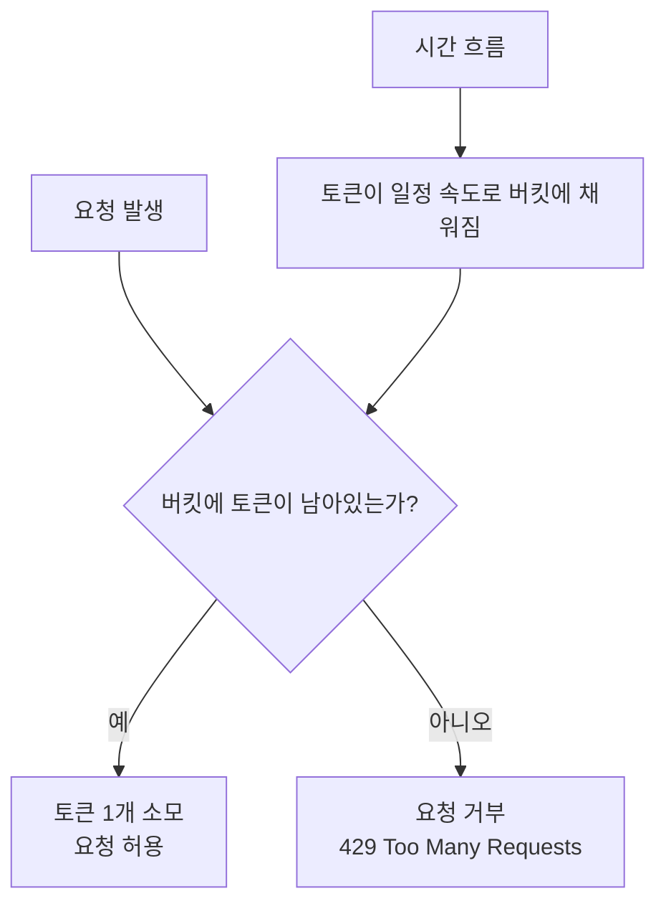

## 🪣 Token Bucket Algorithm (토큰 버킷 알고리즘)

> 요청을 일정한 속도로 제어하기 위한 **Rate Limiting 알고리즘**  
> 초당 허용 가능한 요청 수(QPS)에 따라 **토큰(Token)** 을 일정 속도로 채워두고,  
> 요청 시마다 토큰을 1개씩 사용하여 **과도한 트래픽을 제한**합니다.

---

### 🧠 알고리즘 개요

- **Token Bucket**은 “시간이 지날수록 토큰이 자동으로 채워지는 양동이”로 비유할 수 있습니다.  
- 요청은 토큰을 1개 소모하면서만 처리할 수 있고, 버킷이 비면 요청이 거부됩니다.  
- 일정 속도로 토큰이 채워지므로 평균 요청 속도(QPS)를 제어할 수 있고,  
  순간적인 버스트(일시 폭주)도 **capacity** 만큼 허용됩니다.

| 구성요소 | 설명 |
|-----------|------|
| **Bucket** | 토큰을 담는 공간 (최대 용량 = `capacity`) |
| **Token** | 요청 1건을 처리할 수 있는 권리 |
| **Refill** | 시간당 `refillPerSec` 속도로 토큰이 자동 충전 |
| **Consume** | 요청이 들어올 때마다 토큰 1개 소모 |
| **Empty 상태** | 토큰이 없으면 요청 거부 (`HTTP 429`) |

---

### ⚙️ 작동 원리



---

### ⏱️ 리필(refill) 로직 설명

> 시간 경과에 따라 토큰이 자동으로 채워지는 핵심 알고리즘입니다.

```
elapsedSeconds = (현재시각 - 마지막리필시각) / 1e9
toAdd = floor(elapsedSeconds * refillPerSec)
tokens = min(capacity, tokens + toAdd)
lastRefillNanos += toAdd * nanosPerToken
```

| 변수 | 의미 |
|------|------|
| `refillPerSec` | 초당 토큰 리필 속도 (예: QPS 10) |
| `nanosPerToken` | 토큰 1개가 채워지는 데 걸리는 시간(ns) |
| `floor` | 정수 토큰만 보충 (소수 시간은 다음 호출 때 누적) |
| `lastRefillNanos` | 마지막 리필 시각(나노초 단위) |

> `refill()`은 매 요청 시점에 **게으른(lazy)** 방식으로 호출되어,  
> 마지막 리필 이후 경과된 시간만큼 정수 토큰을 계산하여 보충합니다.  
> 소수 단위의 시간은 다음 호출 시 반영되어 장기적으로 정확한 속도를 유지합니다.

---

### 📈 시간 흐름 예시

```
capacity = 10
refillPerSec = 10  (초당 10개 리필)

초기 상태: tokens = 10
---------------------------------
t=0.00s  요청 7건 → tokens = 3
t=0.30s  0.3초 경과 → floor(0.3*10)=3개 리필 → tokens=6
t=0.55s  0.25초 경과 → 2개 리필 → tokens=8
t=0.62s  0.12초 경과 → 1개 리필 → tokens=9
t=1.00s  0.38초 경과 → 3개 리필 → tokens=10(가득)
```

---

### 🪣 버킷 시각 이미지

```
초기 상태 (10/10)
┌────────────── Bucket ──────────────┐
│••••••••••                          │
└────────────────────────────────────┘

요청 7건 처리 (3/10)
┌────────────── Bucket ──────────────┐
│•••                                 │
└────────────────────────────────────┘

0.5초 경과 후 리필 (+5)
┌────────────── Bucket ──────────────┐
│•••••••••                           │
└────────────────────────────────────┘
```

---

### 💡 특징 요약

| 항목 | 설명 |
|------|------|
| **평균 속도 제어** | 초당 `refillPerSec` 속도로 요청 허용 |
| **버스트 허용** | 일시적 폭주를 `capacity` 범위 내에서 허용 |
| **Lazy Refill** | 요청이 있을 때만 경과 시간 계산 및 리필 |
| **Thread-safe** | `AtomicLong` + CAS 로 멀티스레드 경쟁 방지 |
| **응답 코드** | 토큰 부족 시 `HTTP 429 Too Many Requests` 반환 |

---

### 🧮 QPS 관계

| 설정 | 의미 |
|------|------|
| `refillPerSec = 10` | 초당 10개 토큰 → QPS 10 |
| `capacity = 10` | 최대 10개 요청까지 순간 버스트 허용 |
| `refillPerSec = 100` | 초당 100개 요청 허용 |
| `capacity = 200` | 200개까지 단기 폭주 허용 |

---

### ✅ 정리

- **Token Bucket Algorithm** 은 대표적인 **Rate Limiting 기법**  
- 일정 속도로 토큰을 채우며, 요청 시 토큰을 소모  
- 남은 토큰이 없을 경우 **요청 거부(429)**  
- **Lazy Refill 방식**으로 정수 단위의 시간 정확도 유지  
- 평균 요청 속도(QPS) 제어 및 버스트 대응 가능  

> 💬 본 프로젝트는 **Token Bucket 기반 Rate Limiter**를 사용하며,  
> **Spring Filter 또는 Interceptor**에서 요청 단위로 호출되어  
> 사용자별 **QPS 제한**을 구현합니다.
